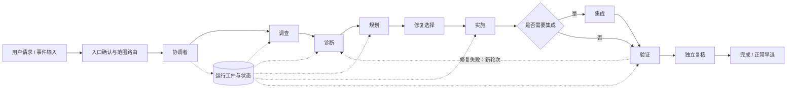

# Multi-Agent Incident Resolution

面向 Codex 的多 Agent 故障闭环 Skill：以证据和权限边界组织调查、根因诊断、独立任务规划、实施池、系统集成、回归验证与独立复核，并支持暂停和恢复。

## 适用范围

适用于复杂服务故障、回归、多问题分诊、大型重构与多模块改造，以及明确要求分阶段 diagnose/repair/review 的任务。普通单缺陷修复、无缺陷证据的功能开发、普通重构或单纯代码解释不应自动触发此 Skill。

## 工作流

完整链路为“入口确认 → 调查 → 诊断 → 修复选择 → 规划 → 实施 → 按需集成 → 验证 → 独立复核”。它是上限，不是必跑清单；无可信问题、无可执行修复、未选择修复、修改已存在或 review 范围为空时会保留准确原因并提前结束。

主 Agent 在“规划 → 实施”时把最终规划、任务、约束和当前状态收敛为活动上下文白名单；验证失败若确认属于修复缺陷，则关闭当前轮次，以失败证据和当前代码状态开启新的“诊断 → 规划 → 实施 → 验证”闭环。旧探索和实施推导保留为审计工件，但不继续占用下一阶段的工作上下文；新轮次不会重置累计尝试上限。

规划按“独立修复闭环 → task → 依赖与 wave → execution mode → implementation Agent”确定执行形态，不按文件或修改点机械拆分，也不因 task 多就默认并行。默认用一个实施 Agent 串行完成；拆分、并行安全和 Agent 预算统一遵循 [工作流协议](references/workflow.md#task-and-pool-shape)，避免各入口重复维护规则。

角色职责、默认路由、上下文边界与交接见 [Agent 角色与交接规范](docs/agent-roles.md)；阶段的执行与早退语义见 [工作流协议](references/workflow.md)。

## 架构概览



完整架构图（包含角色边界、协议依赖、工件流转和退出清理）见 [`skill-architecture.md`](skill-architecture.md)。

## 核心约束

- 入口菜单、单步检查点、修复选择和 Agent 升级统一使用 [确认协议](references/confirmation.md)。
- 调查、诊断、规划、实施、集成、验证、独立复核和终态总结统一使用 [工作流协议](references/workflow.md)。
- 多问题分诊和修复集合选择统一使用 [多问题协议](references/multi-issue.md)。
- 运行元数据、派发台账、任务契约（`tasks.yaml`）和终态标记统一使用 [工件协议](references/artifacts.md)。
- 子 Agent 的 Work Step、Checkpoint、任务状态、worker 运行时状态、停滞判断和终止后证据保留统一使用 [状态与超时协议](references/subagent-state.md)。

核心不变量只保留一份：单文件单写入者由任务契约约束，终态交接与 worker 退出分别验证，敏感输出不进入工件，且只在正常完成时清理已校验的当前 `RUN_ARTIFACT_DIR`。

## 全局 Skill 同步

仓库目录是唯一维护源：

```text
<repository-root>/multi-agent-incident-resolution
```

全局 Skill 使用符号链接：

```text
${HOME}/.agents/skills/multi-agent-incident-resolution
  -> <repository-root>/multi-agent-incident-resolution
```

仓库修改会直接生效。以下脚本用于检查或安全建立链接；若目标已指向其他内容，它会拒绝覆盖：

```sh
sh scripts/sync-global-skill.sh
```

脚本默认使用 `${HOME}/.agents/skills`，也可显式设置 `GLOBAL_SKILLS_ROOT`。不要维护独立全局副本或恢复旧的 `debug-repair` Skill。

## 修改验证

修改 Skill 或参考文档后至少运行：

```sh
python3 "${HOME}/.codex/skills/.system/skill-creator/scripts/quick_validate.py" .
jq empty test-prompts.json
sh -n scripts/*.sh
git diff --check
sh scripts/sync-global-skill.sh
```

涉及流程行为、路由、工件字段或确认语义时，同步更新其权威协议；其他文件只保留必要入口和链接，避免复制规则。

## 许可证

本项目采用 [Apache License 2.0](LICENSE) 开源协议。
