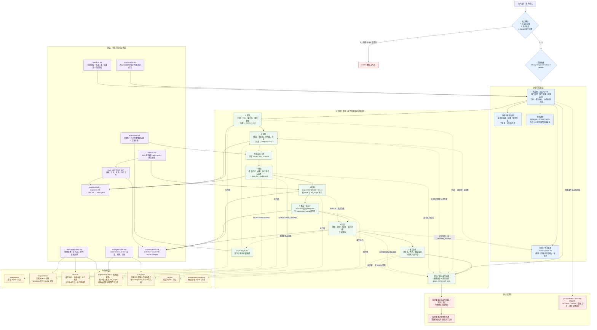

# Multi-Agent Incident Resolution Skill 架构图

> 本图描述当前 skill 的运行时架构、阶段流转、角色边界、协议依赖和运行工件关系。

## 文件映射

| 架构区域 | 当前目录中的权威文件 |
| --- | --- |
| Skill 入口与全局约束 | `SKILL.md` |
| 运行阶段、早退、规划模式、清理 | `references/workflow.md` |
| 用户确认与 Agent 路由披露 | `references/confirmation.md` |
| 多问题发现与修复集合选择 | `references/multi-issue.md` |
| 运行工件、任务契约与终态标记 | `references/artifacts.md` |
| 子 Agent 状态、观察、终止与回收 | `references/subagent-state.md` |
| 角色职责、上下文边界与交接 | `docs/agent-roles.md` |
| 全局同步与运行目录清理 | `scripts/sync-global-skill.sh`、`scripts/cleanup-run-artifacts.sh` |
